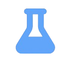
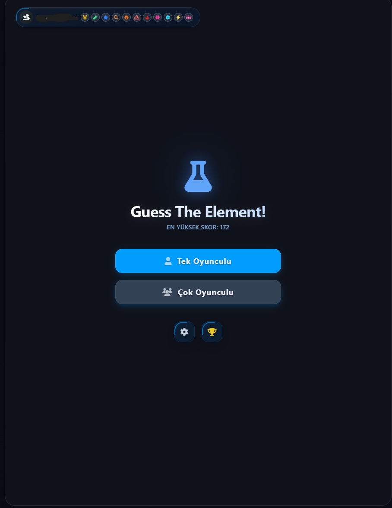
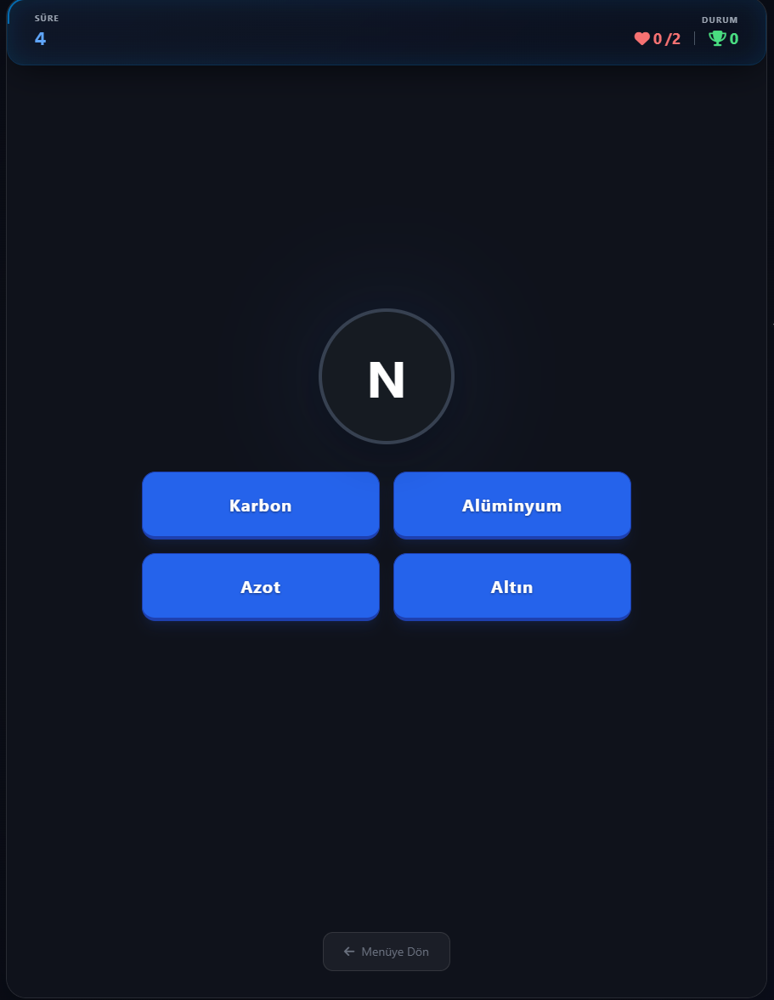
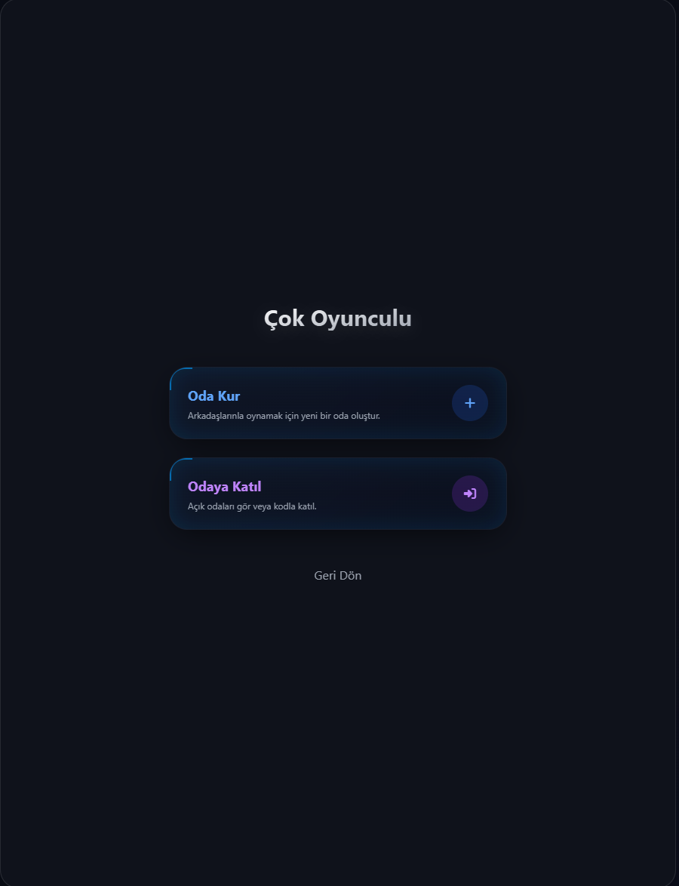

<p align="center">
  
</p>

<h1 align="center">Guess The Element!</h1>

<p align="center">
  Periyodik tablo öğrenimini daha etkili, etkileşimli ve keyifli hale getirmek amacıyla geliştirilen modern bir eğitim oyunu.
</p>

<p align="center">
  <a href="https://guessthelement.web.app/">Canlı Demo</a> •
  <a href="#proje-hakkında">Proje Hakkında</a> •
  <a href="#özellikler">Özellikler</a> •
  <a href="#ekran-görüntüleri">Ekran Görüntüleri</a>
</p>

<p align="center">
  
  
  
  
  
  
</p>

---

## Proje Hakkında

**Guess The Element!**, öğrencilerin element isimlerini, sembollerini ve temel kimya bilgilerini klasik ezber yöntemleri yerine etkileşimli bir oyun deneyimiyle öğrenmelerini sağlayan web tabanlı bir eğitim projesidir.

Proje, kimya öğrenimini daha ilgi çekici hale getirmek ve kullanıcıların bilgilerini aktif olarak test etmelerini sağlamak amacıyla geliştirilmiştir.

Bu GitHub deposu yalnızca projenin tanıtımı için oluşturulmuştur. Kaynak kodlar güvenlik ve fikri mülkiyet nedenleriyle herkese açık olarak paylaşılmamaktadır.

---

## Eğitim Problemine Çözüm

Periyodik tablo, birçok öğrenci için ezberlenmesi zor ve zaman zaman sıkıcı bir konu olabilir.

Guess The Element! bu probleme şu şekilde çözüm sunar:

* Öğrenmeyi oyunlaştırır.
* Kullanıcının aktif katılımını sağlar.
* Anında geri bildirim sunar.
* Motivasyonu artırır.
* Bilgilerin kalıcılığını destekler.

---

## Kişisel Gelişim Açısından Önemi

Bu proje aynı zamanda modern web teknolojileri kullanılarak geliştirilmiş kapsamlı bir yazılım çalışmasıdır.

Geliştirme sürecinde aşağıdaki alanlarda deneyim kazanılmıştır:

* Kullanıcı arayüzü ve kullanıcı deneyimi (UI/UX)
* Performans optimizasyonu
* Gerçek zamanlı veri yönetimi
* Çok oyunculu sistemler
* Responsive tasarım
* Bulut tabanlı servis entegrasyonu

---

## Canlı Demo

Projeyi doğrudan deneyebilirsiniz:

**[https://guessthelement.web.app/](https://guessthelement.web.app/)**

---

## Özellikler

* Element tahmin etmeye dayalı interaktif oyun sistemi
* Tek oyunculu mod
* Gerçek zamanlı çok oyunculu mod
* Liderlik tablosu
* Rozet ve başarı sistemi
* Çoklu dil desteği (Türkçe / İngilizce)
* Mobil ve masaüstü uyumlu tasarım
* Firebase tabanlı bulut altyapısı
* Kullanıcı profilleri
* Ses efektleri ve modern arayüz

---

## Kullanılan Teknolojiler

| Teknoloji                  | Açıklama                 |
| -------------------------- | ------------------------ |
| HTML5                      | Sayfa yapısı             |
| CSS3                       | Stil ve tasarım          |
| JavaScript                 | Oyun mantığı             |
| Tailwind CSS               | Modern arayüz tasarımı   |
| Firebase Authentication    | Kullanıcı yönetimi       |
| Firebase Realtime Database | Çok oyunculu altyapı     |
| Progressive Web App (PWA)  | Uygulama benzeri deneyim |

---

## Ekran Görüntüleri

### Ana Menü



### Oyun Ekranı



### Çok Oyunculu Mod



### Liderlik Tablosu


---

## Proje Yapısı

```text
guesstheelement/
├── README.md
├── assets/
│   ├── logo.png
│   └── screenshots/
│       ├── main-menu.png
│       ├── gameplay.png
│       ├── multiplayer.png
│       └── leaderboard.png
└── docs/
```

---

## Nasıl Kullanılır?

1. Web sitesini açın.
2. Oyuncu adınızı girin.
3. Oyun modunu seçin.
4. Soruları cevaplayın.
5. Sonuçlarınızı inceleyin.
6. Tekrar oynayarak bilginizi geliştirin.

---

## Projenin Katkıları

Bu proje:

* Kimya öğrenimini daha etkili hale getirir.
* Öğrencilerin motivasyonunu artırır.
* Bilgilerin kalıcılığını destekler.
* Eğitim teknolojilerine örnek oluşturur.
* Güçlü bir yazılım portföy çalışması sunar.

---

## Kaynak Kod Durumu

Bu repository yalnızca projenin vitrin sürümüdür.

Kaynak kodlar herkese açık olarak paylaşılmamaktadır.

---

## Bağlantılar

* Canlı Site: [https://guessthelement.web.app/](https://guessthelement.web.app/)
* GitHub Vitrin Reposu: [https://github.com/efwhdn/guesstheelement](https://github.com/efwhdn/guesstheelement)
* Geliştirici Profili: [https://github.com/efwhdn](https://github.com/efwhdn)

---

## Lisans

Bu repository yalnızca proje tanıtımı ve eğitim amaçlı paylaşılmaktadır.

Tüm hakları saklıdır.

---

<p align="center">
  Öğrenmeyi daha etkileşimli ve keyifli hale getirmek için geliştirildi.
</p>
